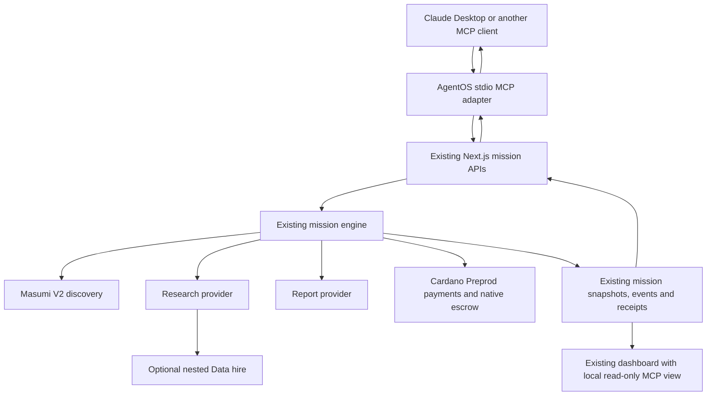

# AgentOS MCP

## What it does

AgentOS gives AI assistants access to an autonomous agent economy. An assistant gives AgentOS a goal and budget; AgentOS discovers, hires, pays and coordinates specialized agents and returns completed work. Claude remains the conversational interface. AgentOS runs the same mission engine used by the dashboard.

The current verified providers are locally managed providers with native Masumi V2 identities. Their reputation is configured metadata, not independently attested reputation. This adapter does not claim verified interoperability with independent public providers.

## Architecture



The adapter calls the actual `/api/missions` creation endpoint, the authenticated `/api/missions/{id}/start` endpoint, and the authenticated `/api/missions/{id}` status endpoint. Execution uses the existing Next.js `after()` scheduling. It does not import or duplicate the mission executor, signing code, ranking, escrow or refund logic. Mission persistence remains `.agentos/{id}.json`; Masumi continues using its existing PostgreSQL services. Normal engine logs remain in the web-server terminal.

## Setup

Requirements: Node.js 22.19 or newer for the pinned Inspector 2.9.0 workflow, npm, a configured AgentOS checkout, and Claude Desktop or another local stdio MCP host. This machine was verified with Node 24.16.0, Next.js 15.5.27 and official MCP SDK 1.32.1. The SDK's installed definitions and [official server documentation](https://ts.sdk.modelcontextprotocol.io/server) were checked before implementation.

```sh
cd /Users/dostonhusanov/AgentOs
npm ci
npm run build
```

`build` produces both the Next.js application and `dist/mcp/server.js`. The standalone MCP build is `npm run mcp:build`. Generated `dist/` files are ignored by Git.

Keep the configured AgentOS web server running in Terminal 1:

```sh
cd /Users/dostonhusanov/AgentOs
npm run start -- --port 3001
```

During development, use `npm run dev -- --port 3001` instead. Run only one AgentOS process for this checkout. `APP_URL` in `.env.local` must match the running server; this checkout uses `http://127.0.0.1:3001`. Keep the existing Masumi containers running for live operation. A successful `npm run demo:check` is the prerequisite for a live mission.

Terminal 2 can run MCP manually:

```sh
npm run mcp:start
```

It waits for a client; there is no interactive terminal prompt. Claude and Inspector should launch the compiled file directly, rather than using an npm wrapper that can print lifecycle banners to stdout:

```sh
/usr/local/bin/node /Users/dostonhusanov/AgentOs/dist/mcp/server.js
```

The MCP process writes diagnostics only to stderr. Stdout is exclusively MCP JSON-RPC. It does not load `.env.local`; API credentials and wallets stay in the existing web server. It resolves its private state relative to the compiled entry point, so Claude's working directory does not matter.

## Claude Desktop configuration

Find actual executable paths before configuring another machine:

```sh
which node
which npm
```

On this Mac, these are `/usr/local/bin/node` and `/usr/local/bin/npm`. The correct compiled entry point is `/Users/dostonhusanov/AgentOs/dist/mcp/server.js`.

Merge this entry into Claude Desktop's configuration, preserving other `mcpServers` entries. On macOS the configuration is normally `~/Library/Application Support/Claude/claude_desktop_config.json`. Use Claude's developer settings to locate/edit the configuration for your installed version, then fully quit and reopen Claude Desktop.

```json
{
  "mcpServers": {
    "agentos": {
      "command": "/usr/local/bin/node",
      "args": ["/Users/dostonhusanov/AgentOs/dist/mcp/server.js"],
      "env": {
        "AGENTOS_BASE_URL": "http://127.0.0.1:3001",
        "AGENTOS_MCP_MAX_BUDGET": "5"
      }
    }
  }
}
```

A ready-to-copy configuration is [mcp/claude-desktop.example.json](mcp/claude-desktop.example.json). Do not copy wallet mnemonics or API keys into Claude's configuration. If the repository or Node location changes, update the absolute paths and rebuild. Claude launches its own MCP child process; a separate manually running MCP server is unnecessary.

## Tools

| Tool                     | Input                                                | Result                                                                                                                                       |
| ------------------------ | ---------------------------------------------------- | -------------------------------------------------------------------------------------------------------------------------------------------- |
| `agentos_create_mission` | `goal`, required `maxBudget`, optional `constraints` | One mission ID, asynchronous acceptance status, budget and local dashboard URL                                                               |
| `agentos_get_mission`    | `missionId`                                          | Current stage, goal, budget, spent/reserved/remaining, selected providers, parent relationships and latest 20 existing events                |
| `agentos_get_result`     | `missionId`                                          | Completed report, recommendation, comparison, evidence, limitations and existing verification events; honest pending/failed status otherwise |
| `agentos_get_receipts`   | `missionId`                                          | Allowlisted payer/provider roles, amount, currency, mode, network, transaction hash, confirmation state, escrow state and refund hash        |

Creation starts execution once and returns promptly. MCP cancellation or disconnection is not forwarded to mission execution. After creation, call `agentos_wait_for_mission` on the same ID. Each wait lasts up to 15 minutes by default (configurable from 1 to 1800 seconds), returning early on completion or failure; if `finished` is false, show the returned logs and repeat with `lastEventId` as `afterEventId`. The tool instructions explicitly tell the host to keep working until a completed or failed status rather than end with a link. Do not create new missions to wait. At terminal status the wait response includes the report and receipts. There is deliberately no long-running synchronous `agentos_run` tool.

## Environment and budget safety

Only two nonsecret MCP settings are used:

| Variable                 | Default                 | Meaning                                                                                                  |
| ------------------------ | ----------------------- | -------------------------------------------------------------------------------------------------------- |
| `AGENTOS_BASE_URL`       | `http://127.0.0.1:3001` | Fixed loopback HTTP origin; paths, credentials, query strings, nonlocal hosts and redirects are rejected |
| `AGENTOS_MCP_MAX_BUDGET` | `5`                     | Operator ceiling in tUSDM, within the existing API's 0.1–1000 range                                      |

`maxBudget` is mandatory, numeric, at least 0.1, at most the operator ceiling, and has at most six decimal places. Goals must be 20–6000 characters; optional constraints are bounded and incorporated into that same limit. The adapter passes `maxBudget` as the existing API's `budget` without accepting policy overrides. Existing defaults remain: maximum single purchase 2 tUSDM, minimum reputation 80, escrow required above 1 tUSDM. Existing reservation, nested-hire and reconciliation logic remains authoritative.

The ceiling is **per mission**, not an aggregate daily allowance. Each creation is a new spending authorization; approve only the intended calls in your MCP client. Preprod tUSDM spending includes nested purchases and existing budget reservations. Test ADA fees and minimum native-token output ADA overhead are separate, as in the existing dashboard. Business capital such as SGD 30,000 belongs in the goal; it is not the `maxBudget` value.

Payment/AI modes come entirely from the running web server's existing `.env.local`. With `PAYMENT_MODE=cardano` and the existing Preprod credentials, the adapter uses real payments and configured escrow. It does not switch modes or simulate production calls. Human-controlled test runs use the existing fixture mode in isolation.

## Testing

No automated test below spends Cardano funds. The stdio tests use an isolated mock HTTP backend; the smoke test starts a source-only temporary checkout of the real Next.js application with `PAYMENT_MODE=simulation` and `AI_MODE=fixture`, no `.env.local`, no live credentials and a separate mission store. It exercises actual mission creation/start/status routes, execution, nested hiring, report generation, receipts and the dashboard bridge. It removes its temporary checkout afterward and leaves live configuration unchanged.

```sh
npm run lint
npm test
npm run mcp:test
npm run mcp:smoke
npm run build
npm run demo:check
```

`demo:check` performs existing connectivity checks, including a small configured AI request; it does not start a mission or sign payments.

### MCP Inspector

The commands below were checked against the [official Inspector](https://github.com/modelcontextprotocol/inspector) version 2.9.0. Use the pinned version because CLI flags changed between releases.

From this checkout, list tools and validate their schemas without starting a mission:

```sh
npx --yes @modelcontextprotocol/inspector@2.9.0 --cli /usr/local/bin/node /Users/dostonhusanov/AgentOs/dist/mcp/server.js --method tools/list --strict --format json
```

For the web Inspector, use the same checked-in configuration as Claude:

```sh
npx --yes @modelcontextprotocol/inspector@2.9.0 --web --config /Users/dostonhusanov/AgentOs/mcp/claude-desktop.example.json --server agentos
```

Open the localhost URL printed by Inspector, connect to `agentos`, and inspect Tools. Initialization and five tools should appear. Validate a negative budget or missing goal: it must fail without creating a mission. An unknown UUID must fail without exposing credentials. To test full creation without funds, run `npm run mcp:smoke`; clicking `agentos_create_mission` against the live configuration **may spend funds**.

After you explicitly authorize a live Inspector test, supply a goal and `maxBudget: 5`, record the returned mission ID, and use the other three tools with that ID. Check the same dashboard URL and public transaction hashes. Do not interpret a successful `tools/list` as proof of real on-chain settlement.

## First Claude test and manual real demo

1. Build, start the existing web server on 3001, keep Masumi running, and verify `npm run demo:check`.
2. Merge the configuration above into Claude Desktop, fully restart Claude, and confirm its `agentos` tool connection.
3. Start a new chat and send the prompt below. Permit the one creation call only if its proposed goal and spending limit match your request.
4. Open the returned `dashboardUrl` in the browser on this Mac. It displays the same mission snapshots, jobs, events, nested relationships and settlements as the original dashboard.
5. Ask Claude to call `agentos_wait_for_mission` repeatedly on that ID, show new logs between windows, then present the bundled completed report and receipts. If the mission fails, inspect its existing receipts and events; never recreate automatically to conceal failure.

> I want to open a small coffee shop in Singapore. I have SGD 30,000 available. Find three suitable neighborhoods, research competitors and typical commercial rents, compare the options quantitatively, estimate a simple first-year budget, and recommend where I should open. You may use AgentOS and spend at most 5 tUSDM to hire specialized AI services. Decide which services are necessary. Use one mission and poll its ID until it completes, then retrieve the result and payment receipts.

Provider selection remains dynamic. Research may hire Data when useful, may work without it, and may use fallback according to the existing engine. DataHub's current city dataset is illustrative and does not provide Singapore commercial rents. The engine must not purchase irrelevant data merely to demonstrate a nested hire. A completed report passes the existing schema/content and configured AI checks; that does not independently establish factual accuracy.

This feature's end-to-end verification is fixture-based. No new paid Cardano mission was run automatically, and Claude Desktop's actual tool-selection behavior still needs the manual test above. Existing Cardano and Masumi settlement evidence remains in [docs/LIVE_VERIFICATION.md](docs/LIVE_VERIFICATION.md).

## Watching the mission

MCP returns `http://127.0.0.1:3001/mcp/mission/{id}`. This is a read-only wrapper around the existing `MissionDashboard`, polling the existing snapshot every three seconds. It does not expose start/failure controls or create another mission/event system. It retains the existing report/PDF and receipt downloads.

Tokens are stored only in ignored `.agentos/mcp/{id}.json` files with mode 0600 and a 0700 directory. The adapter returns no access tokens or token-bearing URLs. Read tools can access only missions whose credentials were created by this installation, and only at their original HTTP origin. Reconnecting Claude uses the durable credentials; deleting this directory removes that access.

The dashboard bridge explicitly trusts the local browser/user on the same Mac. It accepts only a loopback Host, same-origin browser fetch metadata, the recorded origin and an existing MCP-owned mission, then verifies the saved access token internally using existing authorization. It exposes no tokens or mutation endpoints and provides no CORS access. Do not publish this local bridge through a proxy or deploy it as a multi-user service. Other clients under the same OS account share this installation's MCP mission access. Ordinary browser-created missions retain their existing session-token authorization.

## Troubleshooting

- **Server disconnected / executable not found:** run `which node`, verify both absolute paths, and run `npm run mcp:build`. Claude's GUI process may not inherit your shell PATH. Node version managers may move executable paths after upgrades.
- **Nothing happens after manual start:** normal for stdio; a host must send MCP messages. Use Inspector or Claude. Do not type conversational messages into this terminal.
- **Invalid JSON / stdout pollution:** launch the compiled entry point directly with Node. Do not launch it through a noisy shell or npm lifecycle wrapper. Diagnostics belong on stderr; mission logs belong in Terminal 1.
- **Tools list, but creation/status fails:** the separate AgentOS web server must be running at `AGENTOS_BASE_URL`. Confirm `.env.local` `APP_URL` matches the same port and run `npm run demo:check`.
- **Budget rejected:** use a number between 0.1 and the configured ceiling, with at most six decimals. The limit cannot be changed through tool arguments or goal text. A valid budget may still be too small for an affordable plan; the existing engine then fails before purchasing.
- **`start_uncertain`:** creation succeeded but the start acknowledgement was lost/rejected. Poll the returned ID first. Inspect existing mission events and server logs. The adapter never retries this automatically, never issues another purchase to replace it, and offers no recovery mutation tool. If it remains `created`, recover using the existing authenticated API as a local operator.
- **Unknown mission / vault unavailable:** use the ID from this installation's creation response. Existing browser missions and another checkout's IDs are intentionally unavailable. Do not paste tokens into chat. Restore private local files from your own secure backup if needed.
- **Dashboard unavailable:** use exactly the returned loopback URL on this Mac, not another hostname/port. A raw curl request without same-origin browser metadata is intentionally rejected. The page has no secret token in its URL.
- **Mission keeps running after closing Claude:** expected. Execution runs in Next.js. Keep that process alive; the MCP client is not its worker. Existing engine crash-resumption limitations still apply if the web server is stopped during work. Do not restart while missions are active.
- **Escrow result exists but provider release is pending:** preserve the original dispute/unlock deadlines and use existing reconciliation procedures. Completion or a result submission is not evidence of seller release.
- **Inspector syntax differs:** these examples pin 2.9.0. In its CLI, the server command comes immediately after `--cli`, before method flags; web mode uses `--config` and `--server`.

## Implementation and verification scope

Verified on 2026-10-07:

| Check                                                             | Result                                                                                                                                                     |
| ----------------------------------------------------------------- | ---------------------------------------------------------------------------------------------------------------------------------------------------------- |
| `npm run lint` and `npm run format:check`                         | Passed                                                                                                                                                     |
| `npm test`                                                        | 27 tests passed, including unchanged payment/escrow/refund tests                                                                                           |
| `npm run mcp:test`                                                | 5 MCP tests passed: stdio initialization, schemas, budgets, lifecycle projections, citations, durable credentials, sanitization and local dashboard access |
| `npm run mcp:smoke`                                               | Passed through the real existing engine and Next.js APIs in isolated fixture mode: nested hire, three simulated receipts, completed report, dashboard      |
| `npm run build`                                                   | Passed; generated production Next.js routes and compiled MCP entry point                                                                                   |
| Inspector 2.9.0 `tools/list --strict`                             | Passed; all five tools listed with valid schemas and successful initialization                                                                             |
| Inspector using the Claude example config, unknown mission lookup | Safe `isError` response; CLI exit 5 is expected for this negative test                                                                                     |
| `npm run demo:check`                                              | AgentOS READY: Cardano Preprod, configured AI connectivity, four native Masumi identities, escrow scopes, wallets, recipients and HTTP server              |
| Existing completed web mission                                    | Dashboard and authenticated mission API returned HTTP 200; result retained, access token and proof digests omitted from public snapshot                    |

The local production server was restarted after checking that no missions were active. Actual Claude Desktop interaction and a new paid MCP-created mission remain manual checks; neither is claimed as verified by these results.

Added `mcp/adapter.ts`, `mcp/vault.ts`, `mcp/errors.ts`, `mcp/tools.ts`, `mcp/server.ts`, `mcp/browser-access.ts`, `mcp/tsconfig.json`, `mcp/claude-desktop.example.json`, `tests/mcp.test.ts`, `scripts/mcp-smoke.ts`, the local dashboard page/API, and this guide. Updated package scripts/lockfile, generated-file ignores, TypeScript exclusions, formatting coverage, README and the dashboard's optional read-only polling path. Runtime dependency added: official `@modelcontextprotocol/sdk` 1.32.1. PDF generation uses PDFKit 0.20.2 and bundled SIL OFL Noto Sans fonts. No new database, AI or payment dependency was added.

The payment constructor, signing/facilitator, Masumi patches, provider ranking, execution, verification, escrow/refund states and budget reconciliation were not modified. The existing payment/escrow tests remain unchanged. Current npm audit reports pre-existing Next.js/PostCSS advisories; the new SDK dependency graph is not implicated. An unrelated Next.js major upgrade is outside this adapter change.

## Continuous progress in Claude

Restart Claude Desktop after rebuilding so it loads the fifth tool, `agentos_wait_for_mission`. Ask Claude to continue an existing mission using that tool, show new logs between wait windows, and present the report and receipts at completion. You do not need to create another paid mission to test this.

The adapter sends standard MCP progress notifications when the host supplies a progress token. Hosts choose whether to display those notifications. Every completed wait window also returns stage, spending and event logs as ordinary tool output, so hosts can summarize progress even without notification rendering. A wait cancellation stops only monitoring; the mission keeps running.

The adapter can provide progress and explicit continuation instructions, but cannot force Claude to keep a conversation open, override its permissions, exceed its tool/usage limits, or send unsolicited chat messages after Claude ends its turn. The dashboard remains the independent live view of execution. Existing engine logs are reused; no new logging system or spending path was introduced.

### Automatic PDF delivery

Completed wait and result calls include the generated PDF as an embedded MCP resource and resource link, plus an automatic-download browser URL. No additional confirmation is requested. The PDF contains the report, source URLs, budget, public payment receipts and recorded execution events. Private access tokens, signing proofs and escrow quotes are excluded. Claude controls how attachments and progress notifications are displayed; the download URL remains available when binary attachments are not rendered.

The wait tool reads recorded events beyond the short status preview, includes actual transaction hashes for settlement events, and instructs Claude to display timestamped logs and continue waiting on the same mission until completion or failure. It does not invent hiring, refunds or confirmations.

The default wait keeps the MCP call pending instead of returning every 25 seconds. Progress notifications carry recorded events while it runs. Claude may impose its own request timeout, cancellation or tool limit; server instructions cannot override these host controls. If interrupted, resume the same mission ID rather than create a replacement.

### ChatGPT private tunnel

The official macOS ARM64 tunnel client is installed locally under `.agentos/tunnel/bin` (ignored by Git). Its release archive was verified against the official SHA256SUMS. Configure `OPENAI_TUNNEL_ID` and `CONTROL_PLANE_API_KEY` only in `.env.local`. The key must have access to the tunnel; the OpenRouter key cannot authenticate the OpenAI control plane.

Run `node scripts/chatgpt-tunnel.mjs doctor` to validate the profile and `node scripts/chatgpt-tunnel.mjs run` to start the connection. The launcher reads only the needed values from `.env.local` and does not copy wallet phrases to the tunnel process. Local status endpoints are `http://127.0.0.1:8788/healthz` and `/readyz`; the operator UI is `/ui`. Keep the connection running when adding or using the custom MCP plugin in ChatGPT. Restart after closing the process or rebooting the Mac. No machine startup service is installed.
