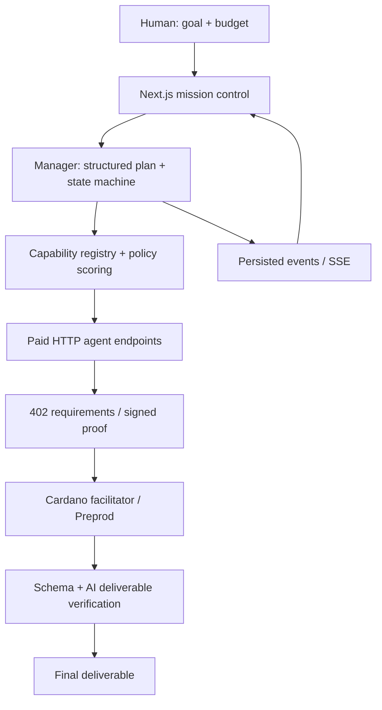
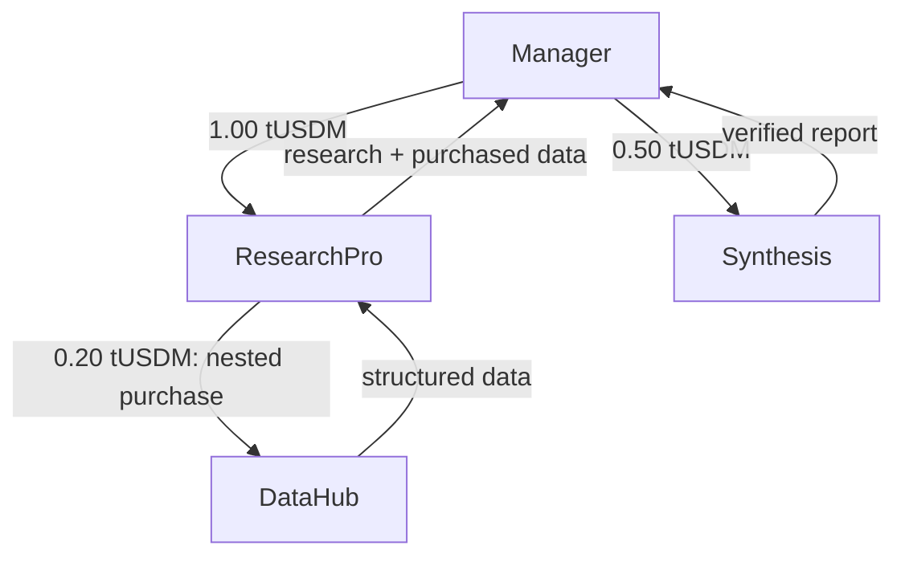

# AgentOS

**Give AI a goal and a budget. It builds the team.**

Claude Desktop and other local MCP clients can now use the same mission engine through five stdio tools. See [AgentOS MCP setup, Claude configuration and testing](MCP.md).

Autonomous AI commerce powered by Cardano. Built for the TOKEN2049 Origins Cardano track.

## 1. Problem

Complex goals require multiple capabilities. People currently choose tools, coordinate providers, and reconcile invoices themselves. Agents need a way to discover and purchase specialized work with bounded spending and traceable decisions.

## 2. Solution

Give the Manager a goal and a tUSDM budget. It plans a dependency graph, discovers providers by capability, ranks eligible providers, purchases services, verifies results, and produces a deliverable. Research providers can independently commission DataHub; their child jobs and receipts identify the research provider as buyer.

**Implementation status:** live Gemini 2.5 Flash through OpenRouter, four native Masumi V2 registrations, and completed direct-payment and escrow-delivery missions are verified on Preprod. Each successful mission includes three confirmed transactions and a nested Research → Data hire, spending or locking 1.70 tUSDM. Escrow delivery and result submission are distinct from seller release, which remains subject to the dispute window. See [live evidence](docs/LIVE_VERIFICATION.md) and [local setup](docs/MASUMI.md).

## 3. Why Cardano

Cardano native assets represent the settlement currency, and transaction receipts make buyer/seller activity inspectable. The exact x402 scheme signs an ordinary Preprod transaction server-side, verifies it with the Cardano facilitator, and gates the resource on confirmed settlement. tUSDM amounts use the SDK's verified Preprod policy and six decimal places. Test ADA pays network fees and accompanies native-token outputs; ADA overhead is separate from the mission's tUSDM spending limit.

## 4. Architecture



```text
app/                   Pages, mission APIs, SSE, paid agent endpoints
components/            Mission form, economy tree, receipts, budget, result
lib/agents/            Registry, scoring, research/data/report, verification
lib/ai/                Gemini client and structured schemas
lib/cardano/           Server signing, x402, durable settlement guard, explorer
lib/mission/           Planning, execution, budget, policy, state, persistence
scripts/               Readiness, wallet addresses, metadata export, smoke test
tests/                 Budget, policy, payload tampering, verification tests
.agentos/              Ignored local mission/proof/claim persistence
```

Target deployment is **one long-lived Node.js process with persistent local disk**, bound to loopback by default. This is not a serverless or multi-replica job runner. JSON snapshots are atomically renamed; synchronous reservations are safe within the one process. A process restart preserves receipts and mission records but does not automatically resume in-flight missions. Pending payments retain reservations for reconciliation. Use PostgreSQL transactions and a durable queue before supporting distributed workers.

## 5. Autonomous Agent Economy

In `AI_MODE=gemini`, the Manager uses structured model output to interpret arbitrary goals against the available capability catalog. The plan is validated for unique task IDs, available capabilities, and topological dependencies. Provider selection is deterministic and explainable:

```text
score = 0.40 capability match
      + 0.30 reputation / 100
      + 0.20 / (1 + price)
      + 0.10 reliability
```

Offline, mismatched, over-budget, low-reputation, cyclic, blocked-capability, and escrow-required providers are rejected before payment. Reputation and reliability in the local registry are configured demo metadata, not independently attested scores.

The Research provider first gathers Google Search grounded evidence, then runs a Gemini tool-calling loop with `discover_agents` and `hire_agent`. It decides whether to commission specialized data. All hiring uses the same policy engine. Maximum depth is three; ancestors cannot be selected again. Tool rounds and specialist purchases are bounded.



Four functioning roles: Manager, Research, Data, and Report. Three research entries demonstrate alternative selection. DataHub serves a controlled, explicitly illustrative city dataset; live research must verify current facts separately. `AI_MODE=fixture` deliberately runs the fixed default mission for offline development; it is labeled and does not claim autonomous model inference or live research.

## 6. x402 Flow

1. Buyer calls a mission-bound provider endpoint without a payment proof.
2. Provider returns HTTP 402, `PAYMENT-REQUIRED`, and v2 payment requirements.
3. Buyer validates exact amount, Preprod network, tUSDM asset, recipient, transfer method, and confirmation policy against the selected provider.
4. In Cardano mode, `toClientCardanoSigner` and `ExactCardanoScheme.createPaymentPayload` build and sign server-side. The client never broadcasts.
5. Signed bytes, a proof digest, and the canonical hash are persisted before settlement.
6. Buyer retries using `PAYMENT-SIGNATURE` and a job idempotency key.
7. Provider validates the job/proof binding. `ExactCardanoScheme.settle` verifies the signed transaction, submits it, and waits for inclusion plus one newer block.
8. Only confirmed settlement changes the receipt to `confirmed` and allows execution. A pending response is retried once using the same signed payload; unresolved settlement halts the mission and retains funds as reserved.
9. The paid provider runs its actual service and returns HTTP 200. The buyer verifies the deliverable before continuing.

Signing and execution queues serialize each buyer wallet to prevent overlapping UTxO selection. Canonical transaction claims prevent cross-job replay. A durable facilitator store prevents blind re-submission after an uncertain crash. It deliberately requires reconciliation if the old process died between claim and broadcast.

**Simulation:** the same HTTP challenge and retry are exercised, with a job-bound simulated proof. Receipts say `SIMULATED PAYMENT`; there is no hash, explorer URL, or wallet transfer. Simulation is a development protocol exercise, not a standard Cardano signed payment.

[Official Cardano x402 guide](https://developers.cardano.org/x402/) · [SDK source and current semantics](https://github.com/x402-foundation/x402/tree/main/typescript/packages/mechanisms/cardano)

## 7. Masumi Integration

Native discovery is selected by `MASUMI_NODE_URL` and confirmed `MASUMI_AGENT_IDS`. It reads the node's documented V2 registry API, binds each identity to an owned AgentOS provider, and validates seller, endpoint, capability, asset and price. Local reputation/reliability remain configured metadata. The older `MASUMI_REGISTRY_URL` normalization gateway remains available; no registry failure silently falls back. Remote service execution remains unsupported.

Native escrow uses the Masumi node's own quotes and purchases. Direct purchases use Cardano x402. Above-threshold jobs are rejected unless native escrow is explicitly enabled for that provider. Lock, result submission, refund authorization and reconciliation paths are wired, with durable intents and budget retention on uncertain outcomes. An escrow lock is distinct from seller release. Confirmed locks and completed nested deliveries are live verified. Refund requests and seller authorization are separate on-chain phases. See [live evidence](docs/LIVE_VERIFICATION.md). See [setup and recovery](docs/MASUMI.md).

[Masumi registry concepts](https://www.masumi.network/dev/masumi/core-concepts/registry) · [Native registration guide](https://www.masumi.network/dev/masumi/documentation/get-started/register-agent)

## 8. Demo

Default goal:

> Research the best city in Southeast Asia for a remote software developer to live for one month. Compare cost of living, internet quality, safety, and coworking options. Give me a final recommendation.

Budget: **5 tUSDM**. Normal local flow spends **1.70**, leaving **3.30**. A simulated initial ResearchPro failure causes Scout Research to replace it. That scenario spends **2.55**, including the first provider's non-refundable direct payment. The UI shows each failed/completed job and every receipt.

A low budget stops execution without paying. Set a high minimum reputation or block a capability through the API to exercise policy rejection.

## 9. Screenshots

The UI includes a dark mission control page, nested agent tree, live execution log, treasury, and receipts. Browser visual verification and screenshot capture remain pending: no browser was connected in the build environment. No screenshots are fabricated or represented as verified renders.

## 10. Setup

Local setup is prepared by `npm run setup`, which creates `.env.local` only if missing and preserves existing values. See [your remaining integration checklist](docs/INTEGRATIONS.md). `npm run wallet:sync` derives the three buyer addresses from configured recovery phrases; `npm run setup:live` validates configuration before enabling live modes.

Requires Node.js 22.13+ (Node.js 24 was used during development) and npm.

```bash
npm install
cp .env.example .env.local
npm run dev
```

Open [http://127.0.0.1:3000](http://127.0.0.1:3000). The example configuration explicitly uses fixture AI and simulated payments. No credentials are needed for that mode.

## 11. Environment Variables

| Variable                         | Purpose                                                                                          |
| -------------------------------- | ------------------------------------------------------------------------------------------------ |
| `AI_MODE`                        | `fixture` or `gemini`; never silently fall back after an Gemini error                            |
| `PAYMENT_MODE`                   | `simulation` or `cardano`; never silently fall back after a payment error                        |
| `GEMINI_API_KEY`                 | Server-only API key for live agents                                                              |
| `GEMINI_MODEL`                   | Gemini model with structured outputs, function tools, and web search; default `gemini-3.8-flash` |
| `APP_URL`                        | Reachable same-process origin; default `http://127.0.0.1:3000`                                   |
| `CARDANO_NETWORK`                | Must be `preprod` in Cardano mode                                                                |
| `BLOCKFROST_PROJECT_ID`          | Preprod provider credentials                                                                     |
| `MANAGER_MNEMONIC`               | Server-only funding wallet seed                                                                  |
| `RESEARCH_MNEMONIC`              | Independent research buyer wallet seed                                                           |
| `RESEARCH_BACKUP_MNEMONIC`       | Replacement research buyer wallet seed                                                           |
| `MANAGER_WALLET_ADDRESS`         | Must match the Manager signer address                                                            |
| `RESEARCH_WALLET_ADDRESS`        | Recipient and Research signer address                                                            |
| `RESEARCH_BACKUP_WALLET_ADDRESS` | Recipient and replacement signer address                                                         |
| `DATA_WALLET_ADDRESS`            | Preprod Data seller address                                                                      |
| `REPORT_WALLET_ADDRESS`          | Preprod Report seller address                                                                    |
| `MAX_AGENT_DEPTH`                | Bounded recursion, maximum 3                                                                     |
| `MASUMI_REGISTRY_URL`            | Optional normalized registry gateway URL                                                         |
| `MASUMI_API_KEY`                 | Optional server-only gateway credential                                                          |

[Gemini Google Search documentation](https://ai.google.dev/gemini-api/docs/google-search) · [Gemini structured outputs](https://ai.google.dev/gemini-api/docs/structured-output)

## 12. Running Locally

```bash
npm run dev                 # development server
npm run lint                # strict TypeScript check
npm run test                # safety-focused unit tests
npm run test:integration     # running server required; refuses live-payment mode
npm run build               # optimized production build
npm start                   # single-process production server
npm run ai:check             # Gemini structured output and Google Search, no payments
npm run demo:check           # environment, AI, wallets, registry, HTTP readiness
npm run demo:live            # live Gemini + real Preprod mission; requires READY
npm run format:check        # formatting
```

`/health` provides a browser readiness page; `/api/health` provides a secret-free JSON summary. `demo:check` additionally makes a small real Gemini request when enabled and checks buyer balances with Blockfrost. `DEVELOPMENT READY` is distinct from `READY`.

Mission access tokens are returned only at creation, held in browser session storage, and required by read/start/event/payment APIs. An internal HMAC also protects provider execution; possession of a browser token alone cannot create signed provider requests. SSE uses the session token in its URL; do not log query strings if placing a reverse proxy in front of the app.

## 13. Cardano Preprod Setup

1. Use three separate test-only BIP-39 wallets for Manager, Research, and Scout. Configure their server-only mnemonics and matching public addresses. Do not use a mainnet wallet seed.
2. Configure separate Data and Report recipients. Verify each address on Preprod.
3. Set `PAYMENT_MODE=cardano`, `CARDANO_NETWORK=preprod`, `AI_MODE=gemini`, and your Gemini/Blockfrost credentials.
4. Fund all buyers with test ADA and tUSDM. For the default mission, Manager needs at least 1.5 tUSDM; for failure recovery, at least 2.35. Each research buyer should have at least 0.2 tUSDM plus test ADA. Fund ample test ADA for fees, token min-UTxO, and change; the readiness check requires at least 5 tADA per buyer.
5. `npm run wallet:check` validates configured signer/address pairs and prints public addresses. It does not transfer funds.
6. Use the [official test ADA faucet](https://docs.cardano.org/cardano-testnets/tools/faucet/) and [tUSDM faucet](https://tusdm.moneta.global).
7. Restart the application after environment changes and run `npm run demo:check`.
8. Run `npm run demo:live` or launch a mission. The command refuses fixture/simulation mode and checks the completed mission for at least one confirmed real transaction and a completed nested hire. It writes a secret-free receipt artifact under `docs/`.
9. A successful real purchase must show a 64-character hash, correct sender and recipient, tUSDM amount, and a Preprod Cardanoscan link. An unconfirmed signed hash is labeled unconfirmed.

No funded wallet or successful Cardano transaction was supplied at initial build time. This gate remains necessary before claiming the hackathon definition of done.

## 14. Agent Registration

```bash
npm run agents:register > agent-metadata.json
```

Without arguments this exports metadata only. With `--submit`, it requests native Preprod V2 registration, persists request IDs, and saves bindings only after confirmation. See [Masumi setup](docs/MASUMI.md).

## 15. Demo Script

1. Open mission control; confirm the execution-mode banner matches the intended demo.
2. Keep the default goal and budget 5. Launch the autonomous mission.
3. Watch the Manager's plan and three research-provider evaluations.
4. Explain why ResearchPro wins and why the premium provider fails policy.
5. Show the first paid HTTP request and receipt.
6. Highlight **ResearchPro → DataHub** beneath the ResearchPro node. The child buyer is ResearchPro, not Manager.
7. Watch data verification, research completion, and Synthesis hiring.
8. Show the final comparison, remaining treasury, and exported mission receipts.
9. For live mode, open a confirmed Cardano explorer link. Never call a simulation receipt an on-chain transaction.
10. Optional recovery: arm the clearly labeled failure control before the first research result. The engine excludes ResearchPro, hires Scout, charges its actual price, and continues. Direct payment loss stays in the treasury total.

The local fixture completes quickly. For a predictable failure demonstration, create a mission through the API, call `/failure`, then `/start` (the smoke script exercises this ordering). Live model timing and whether research elects to purchase specialist data are autonomous decisions; inspect the tool events rather than assuming a fixed script.

## 16. Security

- Private keys and API credentials stay server-side and out of Git/API responses.
- Every purchase is validated against server-owned budget/policy and capability metadata.
- Exact token amounts use six-decimal integer accounting.
- Mission, seller, job, proof, canonical transaction hash, and idempotency key are bound together.
- Buyer/seller identity is represented by independent wallet addresses in confirmed receipts.
- Wallet operations are serialized; failed direct payments are never fabricated as refunds.
- Uncertain settlement retains reservations and stops new hiring, including uncertain child payments.
- Recursion depth, ancestry cycles, tool rounds, input size, and external-call timeouts are bounded.
- Result schemas are validated. Live AI adds objective/research relevance checks. This is a lightweight acceptance check, not a guarantee of factual correctness.
- Local storage has restricted file permissions and atomic snapshots. It contains access tokens and signed proofs and should be protected like server state.
- Structured logs contain correlation IDs and concise event summaries, not wallet credentials.
- This is a local hackathon MVP. Public multi-user hosting requires authentication, creation-rate limits, worker isolation, a persistent transactional database, and an audited payment reconciliation workflow.

## 17. Future Work

Live verification of native Masumi registry/escrow adapters, independent reputation, remote provider transport, durable mission resumption, transactional PostgreSQL storage, wallet fee accounting, distributed workers, broader paid capabilities, and browser/real-chain regression coverage.
